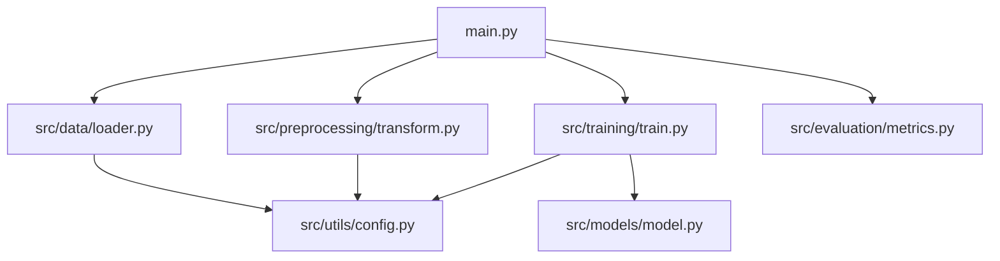

# Design Document: Sentiment Analysis Stage 1

## Overview

A minimal binary sentiment classification pipeline for Amazon product reviews. Loads CSV, preprocesses text (lowercase, remove punctuation, collapse whitespace), maps star ratings to binary labels, builds a simple NumPy-based Bag-of-Words count matrix, trains a LogisticRegression classifier directly on numpy arrays (no sklearn Pipeline wrapper), and evaluates with accuracy, F1, precision, and recall.

Covers course deliverables 1–4: small focused functions, package structure with proper imports, type hints on all functions, and heavy NumPy usage (vocabulary building, count matrix creation, train/test split, metrics computation).

## Architecture



### Data Flow

```mermaid
graph LR
    CSV[CSV File] -->|load_data| DF[Raw DataFrame]
    DF -->|preprocess_dataset| PDF[Clean DataFrame]
    PDF -->|split_dataset| SPLIT[x_train, x_test, y_train, y_test]
    SPLIT -->|build_vocabulary + texts_to_matrix| MAT[NumPy count matrices]
    MAT -->|train_model| MODEL[Fitted LogisticRegression]
    MODEL -->|predict| PRED[np.ndarray predictions]
    PRED -->|evaluate_model| METRICS[Metrics Dict]
```



## Sequence Diagram: Full Pipeline Execution

```mermaid
sequenceDiagram
    participant Main as main.py
    participant Loader as data/loader.py
    participant Preproc as preprocessing/transform.py
    participant Train as training/train.py
    participant Model as models/model.py
    participant Eval as evaluation/metrics.py

    Main->>Loader: load_data("data/raw/reviews.csv")
    Loader-->>Main: pd.DataFrame (raw)

    Main->>Preproc: preprocess_dataset(df)
    Preproc-->>Main: pd.DataFrame (clean, with sentiment column)

    Main->>Train: run_training(df)
    Train->>Train: split_dataset(df) → x_train, x_test, y_train, y_test
    Train->>Preproc: build_vocabulary(x_train)
    Preproc-->>Train: vocab dict
    Train->>Preproc: texts_to_matrix(x_train, vocab)
    Preproc-->>Train: X_train np.ndarray
    Train->>Preproc: texts_to_matrix(x_test, vocab)
    Preproc-->>Train: X_test np.ndarray
    Train->>Model: train_model(X_train, y_train)
    Model-->>Train: fitted LogisticRegression
    Train->>Model: predict(model, X_test)
    Model-->>Train: np.ndarray predictions
    Train->>Eval: evaluate_model(y_test, y_pred)
    Eval-->>Train: metrics dict
    Train-->>Main: results dict

    Main->>Eval: print_report(metrics)
```



## Components and Interfaces

### Component 1: Data Loader (`src/data/loader.py`)

**Purpose**: Load CSV and validate schema.

```python
def load_data(path: str) -> pd.DataFrame: ...
def validate_columns(df: pd.DataFrame, required: list[str]) -> None: ...
```

**Responsibilities**:
- Read CSV into DataFrame
- Raise `FileNotFoundError` if path missing
- Raise `ValueError` if required columns absent

### Component 2: Preprocessing (`src/preprocessing/transform.py`)

**Purpose**: Clean text, normalize labels, and vectorize text into NumPy arrays.

```python
def clean_text(text: str) -> str: ...
def normalize_label(rating: int) -> int | None: ...
def preprocess_dataset(df: pd.DataFrame) -> pd.DataFrame: ...
def build_vocabulary(texts: pd.Series) -> dict[str, int]: ...
def texts_to_matrix(texts: pd.Series, vocab: dict[str, int]) -> np.ndarray: ...
```

**Responsibilities**:
- Text cleaning: lowercase, remove punctuation, collapse whitespace
- Label mapping: rating ≥ 4 → 1, rating ≤ 2 → 0, rating == 3 → None (dropped)
- Vocabulary building: assign index to each unique word from training texts
- Vectorization: convert text list to word-count matrix using NumPy

### Component 3: Model (`src/models/model.py`)

**Purpose**: Train and use LogisticRegression directly on numpy arrays.

```python
from sklearn.linear_model import LogisticRegression

def train_model(X_train: np.ndarray, y_train: np.ndarray) -> LogisticRegression: ...
def predict(model: LogisticRegression, X: np.ndarray) -> np.ndarray: ...
```

**Responsibilities**:
- Fit LogisticRegression on count matrix
- Return predictions as np.ndarray of 0/1

### Component 4: Training (`src/training/train.py`)

**Purpose**: Orchestrate splitting, vectorization, training, and evaluation.

```python
def split_dataset(
    data: pd.DataFrame,
    text_column: str,
    label_column: str,
    test_size: float,
) -> tuple[pd.Series, pd.Series, pd.Series, pd.Series]: ...

def run_training(data: pd.DataFrame) -> dict[str, object]: ...
```

**Responsibilities**:
- NumPy-based train/test split
- Call build_vocabulary on training texts only
- Vectorize train and test texts using same vocabulary
- Train model, predict, evaluate, return results

### Component 5: Evaluation (`src/evaluation/metrics.py`)

**Purpose**: Compute and display classification metrics using NumPy.

```python
def evaluate_model(y_true: Sequence[int], y_pred: Sequence[int]) -> dict[str, float]: ...
def print_report(metrics: dict[str, float]) -> None: ...
```

### Component 6: Configuration (`src/utils/config.py`)

```python
TEXT_COLUMN: str = "reviews.text"
RATING_COLUMN: str = "reviews.rating"
LABEL_COLUMN: str = "sentiment"
MIN_POSITIVE_RATING: int = 4
MAX_NEGATIVE_RATING: int = 2
TEST_SIZE: float = 0.2
RANDOM_SEED: int = 42
```

## Data Models

### Raw Dataset Schema

| Column | Type | Description |
|--------|------|-------------|
| `reviews.text` | str | Free-text product review |
| `reviews.rating` | int/float | Star rating 1–5 |

### Processed DataFrame Schema

| Column | Type | Description |
|--------|------|-------------|
| `reviews.text` | str | Cleaned text |
| `reviews.rating` | int | Original rating (no 3s) |
| `sentiment` | int | Binary label: 0 or 1 |

### Metrics Dictionary

```python
{"accuracy": float, "f1_score": float, "precision": float, "recall": float}
```

## Key Functions with Formal Specifications

### `load_data(path: str) -> pd.DataFrame`

**Preconditions:** path is non-empty string; file exists; file is valid CSV with headers
**Postconditions:** Returns DataFrame with columns `reviews.text` and `reviews.rating`; raises FileNotFoundError or ValueError on failure

---

### `clean_text(text: str) -> str`

**Preconditions:** text is a string
**Postconditions:** result is all lowercase; no punctuation; no leading/trailing whitespace; no consecutive spaces; idempotent

---

### `normalize_label(rating: int) -> int | None`

**Preconditions:** rating is int in [1, 5]
**Postconditions:** rating ≥ 4 → 1; rating ≤ 2 → 0; rating == 3 → None

---

### `preprocess_dataset(df: pd.DataFrame) -> pd.DataFrame`

**Preconditions:** df has `reviews.text` and `reviews.rating` columns
**Postconditions:** returned df has `sentiment` column with values in {0, 1}; no NaN rows; no neutral rows; len(result) ≤ len(input)

---

### `build_vocabulary(texts: pd.Series) -> dict[str, int]`

**Preconditions:** texts is a Series of cleaned strings
**Postconditions:** returns dict mapping each unique word to a unique integer index (0-based); keys are all words found in texts; values are contiguous integers [0, len(vocab))

---

### `texts_to_matrix(texts: pd.Series, vocab: dict[str, int]) -> np.ndarray`

**Preconditions:** texts is Series of cleaned strings; vocab is non-empty dict from build_vocabulary
**Postconditions:** returns np.ndarray of shape (len(texts), len(vocab)); each cell [i, j] is count of word j in text i; dtype is numeric; words not in vocab are ignored (zero count)

---

### `split_dataset(...) -> tuple[pd.Series, pd.Series, pd.Series, pd.Series]`

**Preconditions:** data has required columns; 0 < test_size < 1; data has ≥ 2 rows
**Postconditions:** len(x_train) + len(x_test) == len(data); sets are disjoint; deterministic with same RANDOM_SEED

---

### `train_model(X_train: np.ndarray, y_train: np.ndarray) -> LogisticRegression`

**Preconditions:** X_train is 2D array; y_train is 1D array of {0,1}; len(X_train) == len(y_train)
**Postconditions:** returns fitted LogisticRegression that can call .predict()

---

### `predict(model: LogisticRegression, X: np.ndarray) -> np.ndarray`

**Preconditions:** model is fitted; X is 2D array with same number of columns as training data
**Postconditions:** returns np.ndarray of shape (len(X),) with all values in {0, 1}

---

### `evaluate_model(y_true, y_pred) -> dict[str, float]`

**Preconditions:** len(y_true) == len(y_pred); all values in {0, 1}
**Postconditions:** returns dict with keys accuracy, f1_score, precision, recall; all values in [0.0, 1.0]; division-by-zero returns 0.0

## Algorithmic Pseudocode

### Text Cleaning

```python
import re
import string

def clean_text(text: str) -> str:
    text = text.lower()
    text = text.translate(str.maketrans("", "", string.punctuation))
    text = re.sub(r"\s+", " ", text).strip()
    return text
```

---

### Build Vocabulary (NumPy-relevant)

```python
def build_vocabulary(texts: pd.Series) -> dict[str, int]:
    vocab: dict[str, int] = {}
    idx = 0
    for text in texts:
        for word in text.split():
            if word not in vocab:
                vocab[word] = idx
                idx += 1
    return vocab
```

---

### Texts to Count Matrix (NumPy)

```python
import numpy as np

def texts_to_matrix(texts: pd.Series, vocab: dict[str, int]) -> np.ndarray:
    matrix = np.zeros((len(texts), len(vocab)), dtype=np.float64)
    for i, text in enumerate(texts):
        for word in text.split():
            if word in vocab:
                matrix[i, vocab[word]] += 1
    return matrix
```

This demonstrates NumPy array creation and manipulation (deliverable 4).

---

### Train/Test Split (NumPy)

```python
import numpy as np
from src.utils.config import RANDOM_SEED

def split_dataset(data, text_column, label_column, test_size):
    rng = np.random.default_rng(RANDOM_SEED)
    n = len(data)
    indices = np.arange(n)
    rng.shuffle(indices)
    n_test = int(n * test_size)
    test_idx = indices[:n_test]
    train_idx = indices[n_test:]
    x_train = data[text_column].iloc[train_idx].reset_index(drop=True)
    x_test = data[text_column].iloc[test_idx].reset_index(drop=True)
    y_train = data[label_column].iloc[train_idx].reset_index(drop=True)
    y_test = data[label_column].iloc[test_idx].reset_index(drop=True)
    return x_train, x_test, y_train, y_test
```

---

### Model Training and Prediction

```python
from sklearn.linear_model import LogisticRegression
from src.utils.config import RANDOM_SEED

def train_model(X_train: np.ndarray, y_train: np.ndarray) -> LogisticRegression:
    model = LogisticRegression(max_iter=1000, random_state=RANDOM_SEED)
    model.fit(X_train, y_train)
    return model

def predict(model: LogisticRegression, X: np.ndarray) -> np.ndarray:
    return np.asarray(model.predict(X), dtype=int)
```

---

### Evaluation Metrics (NumPy)

```python
import numpy as np
from typing import Sequence

def evaluate_model(y_true: Sequence[int], y_pred: Sequence[int]) -> dict[str, float]:
    yt = np.asarray(y_true, dtype=int)
    yp = np.asarray(y_pred, dtype=int)
    tp = int(np.sum((yp == 1) & (yt == 1)))
    tn = int(np.sum((yp == 0) & (yt == 0)))
    fp = int(np.sum((yp == 1) & (yt == 0)))
    fn = int(np.sum((yp == 0) & (yt == 1)))
    total = tp + tn + fp + fn
    accuracy = (tp + tn) / total if total > 0 else 0.0
    precision = tp / (tp + fp) if (tp + fp) > 0 else 0.0
    recall = tp / (tp + fn) if (tp + fn) > 0 else 0.0
    f1 = 2 * precision * recall / (precision + recall) if (precision + recall) > 0 else 0.0
    return {"accuracy": accuracy, "f1_score": f1, "precision": precision, "recall": recall}
```

---

### Run Training Orchestration

```python
def run_training(data: pd.DataFrame) -> dict[str, object]:
    x_train, x_test, y_train, y_test = split_dataset(data, TEXT_COLUMN, LABEL_COLUMN, TEST_SIZE)
    vocab = build_vocabulary(x_train)
    X_train = texts_to_matrix(x_train, vocab)
    X_test = texts_to_matrix(x_test, vocab)
    model = train_model(X_train, y_train.to_numpy())
    y_pred = predict(model, X_test)
    metrics = evaluate_model(y_test, y_pred)
    return {"model": model, "predictions": y_pred, "y_test": y_test, "metrics": metrics, "vocab": vocab}
```

## Example Usage

```python
from src.data.loader import load_data
from src.preprocessing.transform import preprocess_dataset, clean_text, normalize_label

# Load and preprocess
df = load_data("data/raw/reviews.csv")
df = preprocess_dataset(df)

# Individual functions
assert clean_text("  Hello, WORLD!!  ") == "hello world"
assert normalize_label(5) == 1
assert normalize_label(3) is None

# Full pipeline
from src.training.train import run_training
results = run_training(df)
print(f"Accuracy: {results['metrics']['accuracy']:.4f}")

# Single prediction
from src.preprocessing.transform import build_vocabulary, texts_to_matrix
from src.models.model import predict
import pandas as pd
new_texts = pd.Series(["this product is amazing"])
X_new = texts_to_matrix(new_texts, results["vocab"])
pred = predict(results["model"], X_new)
print(f"Prediction: {'positive' if pred[0] == 1 else 'negative'}")
```

## Correctness Properties

### Property 1: Text cleaning idempotency

*For any* string, `clean_text(clean_text(text)) == clean_text(text)`.

**Validates: Requirements 2.5**

### Property 2: Clean text output format

*For any* string, `clean_text(text)` contains only lowercase alphanumeric characters and single spaces, with no leading/trailing whitespace.

**Validates: Requirements 2.1, 2.2, 2.3**

### Property 3: Label determinism

*For any* rating in {1,2,3,4,5}, `normalize_label(rating)` always returns the same value in {0, 1, None}.

**Validates: Requirements 3.1, 3.2, 3.3, 3.4**

### Property 4: Preprocessing row reduction

*For any* valid DataFrame, `len(preprocess_dataset(df)) <= len(df)`.

**Validates: Requirements 4.6**

### Property 5: Vocabulary completeness

*For any* texts Series, `build_vocabulary(texts)` assigns a unique index to every distinct word appearing in texts, and all indices are contiguous from 0.

**Validates: Requirements 5.1, 5.2**

### Property 6: Matrix shape correctness

*For any* texts and vocab, `texts_to_matrix(texts, vocab).shape == (len(texts), len(vocab))`.

**Validates: Requirements 15.1**

### Property 7: Matrix non-negativity

*For any* texts and vocab, all values in `texts_to_matrix(texts, vocab)` are ≥ 0.

**Validates: Requirements 15.1**

### Property 8: Split conservation

*For any* DataFrame with ≥ 2 rows, `len(x_train) + len(x_test) == len(data)`.

**Validates: Requirements 5.4**

### Property 9: Split reproducibility

*For any* DataFrame, calling `split_dataset` twice with same seed produces identical splits.

**Validates: Requirements 5.6**

### Property 10: Prediction output invariant

*For any* fitted model and valid X, `predict(model, X)` returns array of shape `(len(X),)` with all values in {0, 1}.

**Validates: Requirements 8.1, 8.2, 8.3**

### Property 11: Metrics range

*For any* binary arrays y_true, y_pred, all values in `evaluate_model(y_true, y_pred)` are in [0.0, 1.0].

**Validates: Requirements 9.4, 9.5, 9.6, 9.7, 9.8**

## Error Handling

| Scenario | Response |
|----------|----------|
| File not found | `load_data` raises `FileNotFoundError` |
| Missing columns | `validate_columns` raises `ValueError` |
| Empty dataset after preprocessing | `run_training` raises `ValueError` |
| All predictions one class | Metrics return 0.0 for undefined ratios |

## Testing Strategy

### Unit Tests (pytest)

Simple assertions, no property-based testing library needed.

```python
# test_preprocessing.py
assert clean_text("Hello, World!") == "hello world"
assert normalize_label(5) == 1
assert normalize_label(3) is None

# test_transform.py
vocab = build_vocabulary(pd.Series(["hello world", "hello"]))
assert "hello" in vocab
assert "world" in vocab
matrix = texts_to_matrix(pd.Series(["hello hello"]), vocab)
assert matrix[0, vocab["hello"]] == 2

# test_evaluation.py
m = evaluate_model([1, 1, 0, 0], [1, 0, 0, 1])
assert m["accuracy"] == 0.5
assert 0.0 <= m["f1_score"] <= 1.0
```

### Integration Test

Small fixture CSV (5–10 rows) tests full pipeline end-to-end without errors.

## Dependencies

| Package | Purpose |
|---------|---------|
| pandas | DataFrame, CSV loading |
| numpy | Array ops, vectorization, split, metrics |
| scikit-learn | LogisticRegression only (no Pipeline, no TfidfVectorizer) |
| pytest | Test runner (dev) |
